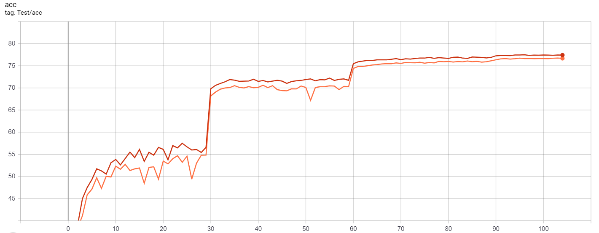

# pytorch-classification-advprop
A PyTorch implementation of CVPR2020 paper Adversarial examples improve image recognition by Xie C, Tan M, Gong B, et al. 

Thanks for guidance from Cihang Xie and Yingwei Li. The code is adapted from https://github.com/bearpaw/pytorch-classification.


## Features
* Multi-GPU support
* Training progress bar with rich info
* Training log and training curve visualization code (see `./utils/logger.py`)
* Training log using tensorboardX

## Environments
This project is developed and tested in the following environments.
* Ubuntu 16.04
* CUDA 10.0.130
* TITAN Xp
* Python 3.8.1

## Requirements
* Install [matplotlib]
* Install [numpy]
* Install [PyTorch]
* Install [torchvision]
* Install [tensorboardX]

## Training
This is the example command for training:
```
python imagenet.py --attack-iter 1 --attack-epsilon 1 --attack-step-size 1 -a resnet50 --train-batch 256 --num_classes 1000 --data /path/of/ImageNet --epochs 105 --schedule 30 60 90 100 --gamma 0.1 -c checkpoints/imagenet/advresnet-resnet50-smoothing --gpu-id 0,1,2,3,4,5,6,7 --lr_schedule step --mixbn
```
For all the commonly used parameters:
* --attack-iter: the number of PGD attacker iterations. If you want to train model without AdvProp, you should set attack-iter as zero.
* --attack-epsilon: the maximum range of the noise after accumulation during all the iterations.
* --attack-step-size: the step size of PGD attacker, which means the range of the noise during each iteration.
* -a: architecture of the model, we can choose the model in [torchvision.models.resnet](https://github.com/pytorch/vision/blob/master/torchvision/models/resnet.py).
* --train-batch: total batches on all the GPUs.
* --num_classes: number of classes in the dataset, for ImageNet this value should be set as 1000.
* --data: path to your ImageNet dataset.
* --epochs: number of epochs.
* --schedule: if lr_schedule is set as 'step', then the learning rate will multiply the parameter gamma at the specific epoch as listed in schedule.
* --gpu-id: ids for the GPUs you could use.
* --lr_schedule: the training sheme. I recommand 'step' settings.

More options could be seen in the code.
## Accuracy curve

The figure below is the comparasion between ResNet-50 with standard training and advprop (using PGD-1). The red curve is the test accuracy with advprop and the orange curve is the accuracy with standard training.

It is obivous that the test accuracy under the advprop setting consistenly exceeds that under standard trainig. Another notable feature is that the accuracy using main batch normalization consistenly exceeds that using auxiliary batch normalization.



The settings are the same as in run.sh. Finally, the ResNet-50 top1 test accuracy using standard training is 76.67%, and that using advprop is 77.42%. 

If possible, we will provide more results in the future.


## Contribute
Feel free to create a pull request if you find any bugs or you want to contribute.
